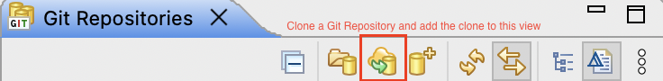

## 1. Create a new Repo and Push to Github

https://www.youtube.com/watch?v=LPT7v69guVY

Step 1 : Create GitHub account and Sign In

Step 2 : Create a repository in your Github, save the github link

Step 3 : Start Eclipse

Step 4 : Go to Perspective - Git Repositories and click on Add Git Repo

Step 5 : Create a project in Eclipse

Step 6 : Do a right click on Project - Team - Share - create - Create a new folder for git repo (local) - (optional) change default branch name - Finish

Step 7: Do some work in Eclipse

Step 8 : Go to Git perspective, stage your file, Commit and Push the project to the repo (push head) -> paste the GitHub link, under "User": enter your email for GitHub, under "password": enter your **ACCESS TOKEN**

While pushing to github you will NOW need to provide ACCESS TOKEN in place of password To generate Access Token 

1. Login to your GitHub account 
2. Verify your email address, if it hasn't been verified yet. 
3. In the upper-right corner of any page, click your profile photo, then click Settings. 
4. In the left sidebar, click Developer settings. 
5. In the left sidebar, click Personal access tokens. 
6. Click Generate new token. 
7. Give your token a descriptive name. 
8. To give your token an expiration, select the Expiration drop-down menu, then click a default or use the calendar picker 
9. Select the scopes, or permissions, you'd like to grant this token. To use your token to access repositories from the command line, **select repo**. 
10. Click Generate token and save the token

### 1.1 Create git in a different folder from Eclipse workspace

Step 1 : Create GitHub account and SignIn

Step 2 : Start a Project = Create a repository

Step 3 : Start Eclipse

Step 4 : Do a right click on Project - Team - Share Project- Create new git repo (not in the same folder)

Step 5 : Commit and Push the project to the repo

Step 6 : Commit and Push every change to the repo

Step 7: Push head -> connect to github repo

### 1.2 Create git in the same folder with Eclipse Workspace 

Step 1 : Create GitHub account and SignIn

Step 2 : Start a Project = Create a repository

Step 3: Start a Project

Step 4: Go to Git perspective, create a new repository inside the same project folder

Step 5: do a commit 

Step 6: Commit and Push -> Ignore error -> Push the head -> github url

## 2. Download existing files from Github

Step 0: Go to Git Perspective: open eclipse -> click on "Window" in the menu bar -> Perspective -> Open Perspective -> Other -> Git -> Open

Step 1: Clone a Git Repo and add the clone to this view -> Clone URI -> Select the branch to clone -> (Optional) Tag fetching strategy: Fetch all tags and their commits -> Next

Step 2: Destination: Choose a local folder to store and take notes of the folder name -> Finish

Step 3: Right click on the project repository -> Switch to -> new branch -> Enter name of new branch -> check "Check out new branch" -> Finish

Step 4: Go back to the Project Perspective: click on "Window" in the menu bar -> Perspective -> Open Perspective -> Other -> Java (default) -> Open

Step 5: Select File -> Import -> Git -> Projects from Git -> Existing local repository -> Select the git repo you want to work on -> Next -> Import using the New Project wizard -> Finish ->  Java -> Java Project -> Next -> Uncheck "Use default location" -> Browser the location of the folder name you just noted down -> Finish -> Congratulations! You can now start working on your own branch.

